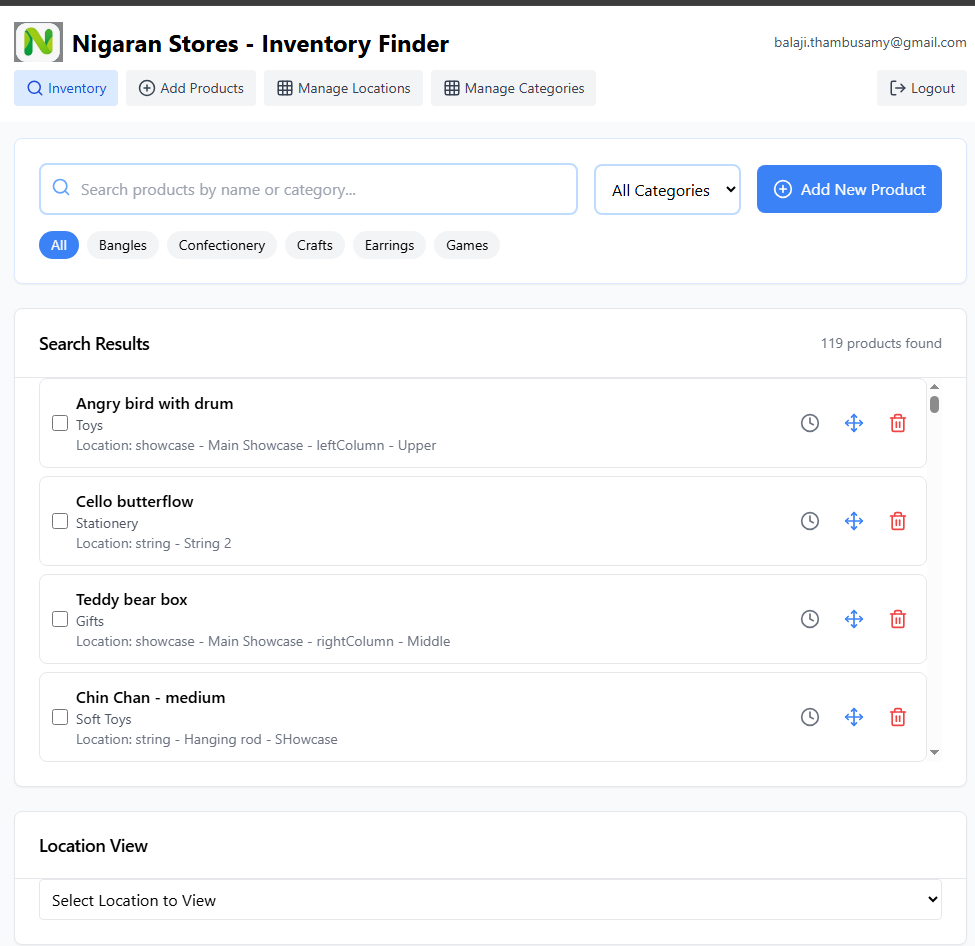
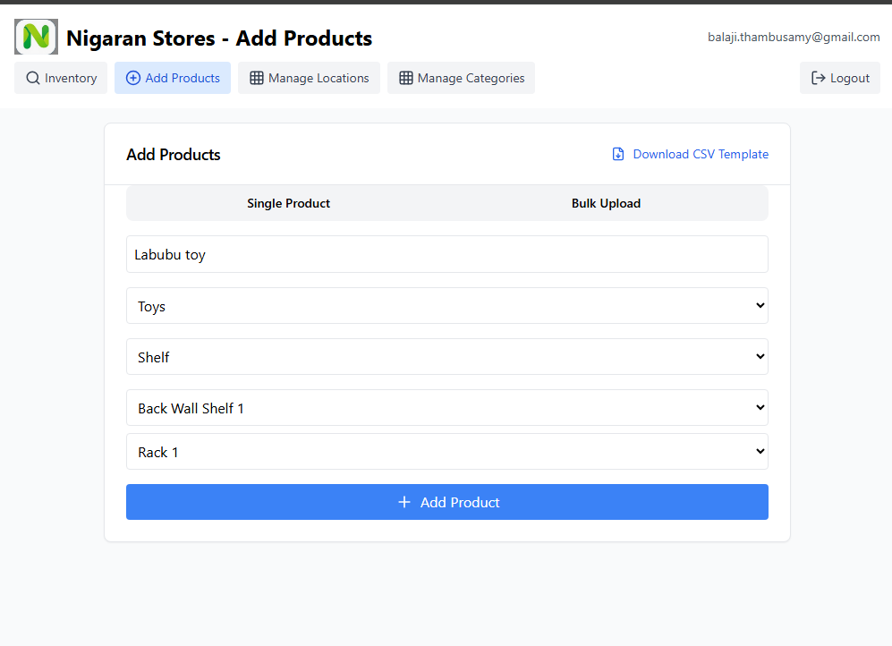
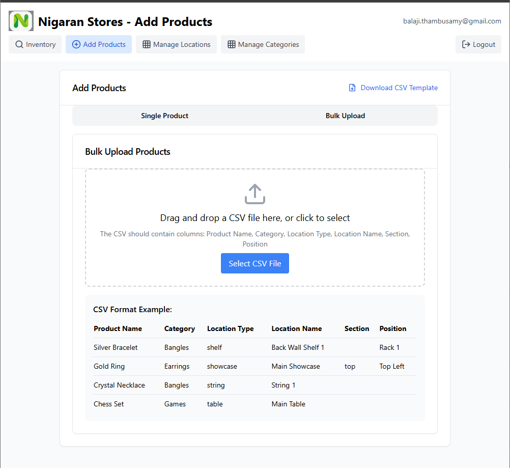
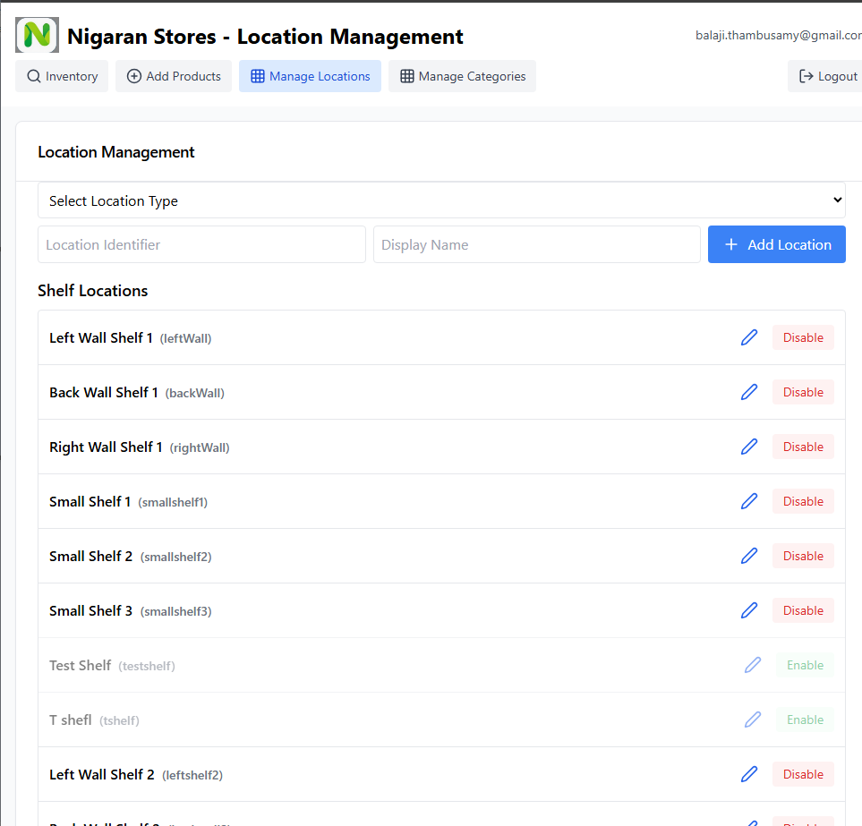
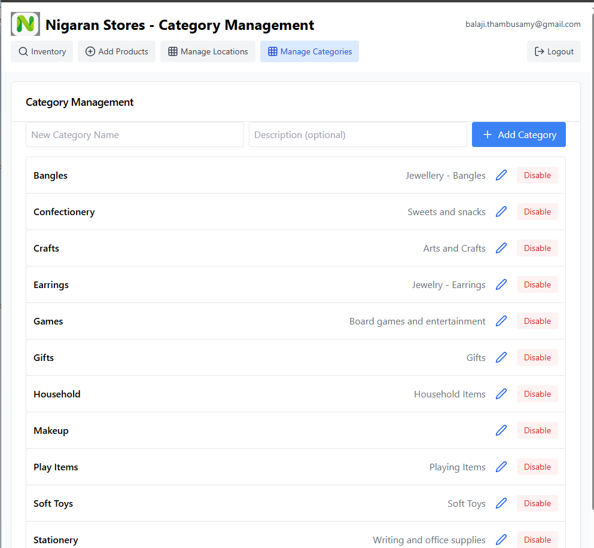
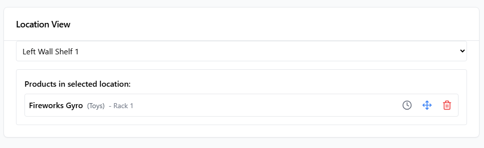

# Shelfie - Smart Inventory & Product Location Management Platform

A modern inventory and product location management platform built to help retail stores quickly locate products, manage inventory organization, and maintain accurate location tracking across multiple storage areas.

Originally developed to solve real-world product discovery challenges inside a retail environment, Shelfie enables staff to find products in seconds rather than manually searching shelves, showcases, racks, and display locations.

---

## Business Problem

As product variety grows, retailers often struggle with:

- Locating products quickly
- Managing display locations
- Tracking inventory organization
- Maintaining category structures
- Onboarding new staff unfamiliar with store layouts

Shelfie addresses these challenges through a centralized product location management platform.

---

## Key Features

### Product Search & Inventory Finder

- Instant product search
- Category filtering
- Product location lookup
- Location hierarchy navigation



---

### Product Management

- Add individual products
- Edit product details
- Assign categories
- Associate products with precise locations



---

### Bulk Product Import

- CSV upload support
- Rapid inventory onboarding
- Template-based imports
- Validation and error handling



---

### Location Management

Supports multiple location types:

- Shelves
- Showcases
- Strings
- Tables
- Display Areas
- Custom Locations

Store administrators can create, modify, and organize locations dynamically.



---

### Category Management

- Category creation
- Category maintenance
- Category enable/disable
- Product grouping



---

### Product Location Visualization

View all products stored within a selected location.

Benefits:

- Faster stock retrieval
- Better display organization
- Improved inventory accuracy



---

## Technology Stack

### Frontend

- React
- Tailwind CSS

### Backend Services

- Firebase Authentication
- Firestore Database

### Deployment

- Firebase Hosting

---

## Architecture

```text
React Frontend
        |
        |
Firebase Authentication
        |
        |
Firestore Database
        |
        |
Product Locations
Categories
Inventory Records
Movement History
```
Core Functional Areas
Inventory Management

Manage products and inventory records.

Product Location Tracking

Track exactly where products are displayed or stored.

Category Management

Organize products into logical groups.

Bulk Import Processing

Quickly onboard large product catalogs.

User Authentication

Secure access using Firebase Authentication.

Example Location Structure
Store
│
├── Shelves
│   ├── Left Wall Shelf 1
│   ├── Left Wall Shelf 2
│   └── Right Wall Shelf 1
│
├── Showcases
│   ├── Main Showcase
│   │   ├── Top Section
│   │   ├── Left Column
│   │   └── Right Column
│
└── Strings
    ├── String 1
    ├── String 2
    └── String 3


Real-World Use Cases
Gift Shops
Toy Stores
Jewellery Stores
Boutique Retailers
Hobby Stores
Department Stores
Warehouse Display Areas
Future Enhancements
Barcode Scanning
QR Code Product Lookup
Inventory Stock Levels
Mobile Application
Product Analytics Dashboard
Product Movement Audit Trail
Author

Balaji T.

Enterprise Application Modernization Specialist

Upwork:
https://www.upwork.com/freelancers/~017c0176f6371f83c1?viewMode=1

GitHub:
https://github.com/btggithub

Project Status

✅ Active Open Source Project

This project demonstrates practical inventory management, product location tracking, React development, Firebase integration, and business application design.

## Key Components

### LocationManager.js
Manages physical locations where products are stored. Provides:
- Location CRUD operations
- Product movement tracking
- Location analytics

### ShopInventoryMain.js
Core inventory management component that:
- Displays current inventory
- Handles product movements
- Integrates with LocationManager

### Firebase Integration
- Authentication via `ShopInventoryAuth.js`
- Data storage via `firebase.js`
- Real-time updates using Firestore listeners

## Setup Instructions

1. Clone the repository
2. Install dependencies: `npm install`
3. Configure Firebase:
   - Create a `.env` file in the root directory.
   - Add the following environment variables with your Firebase project credentials:
     ```
     REACT_APP_FIREBASE_API_KEY=your_api_key
     REACT_APP_FIREBASE_AUTH_DOMAIN=your_auth_domain
     REACT_APP_FIREBASE_PROJECT_ID=your_project_id
     REACT_APP_FIREBASE_STORAGE_BUCKET=your_storage_bucket
     REACT_APP_FIREBASE_MESSAGING_SENDER_ID=your_messaging_sender_id
     REACT_APP_FIREBASE_APP_ID=your_app_id
     REACT_APP_FIREBASE_MEASUREMENT_ID=your_measurement_id
     ```

4. Start development server: `npm start`

## Data Flow

1. User authenticates via `ShopInventoryAuth`
2. Main inventory view loads from `ShopInventoryMain`
3. Location data fetched via `LocationManager`
4. Product movements recorded in Firestore
5. History tracked via `ProductHistory` component

## Extending the System

To add new features:
1. Create new component in `src/components/`
2. Connect to Firebase via `firebase.js`
3. Add routing in `App.js` if needed
4. For data migrations, use `Data migration/` scripts

## API Reference

### Firebase Collections
- `locations` - Stores physical locations
- `products` - Product inventory
- `movements` - Product movement history

### Key Functions
- `addLocation()` (LocationManager.js) - Adds new storage location
- `moveProduct()` (ShopInventoryMain.js) - Handles product transfers
- `getCategoryStats()` (CategoryManager.js) - Returns category analytics
